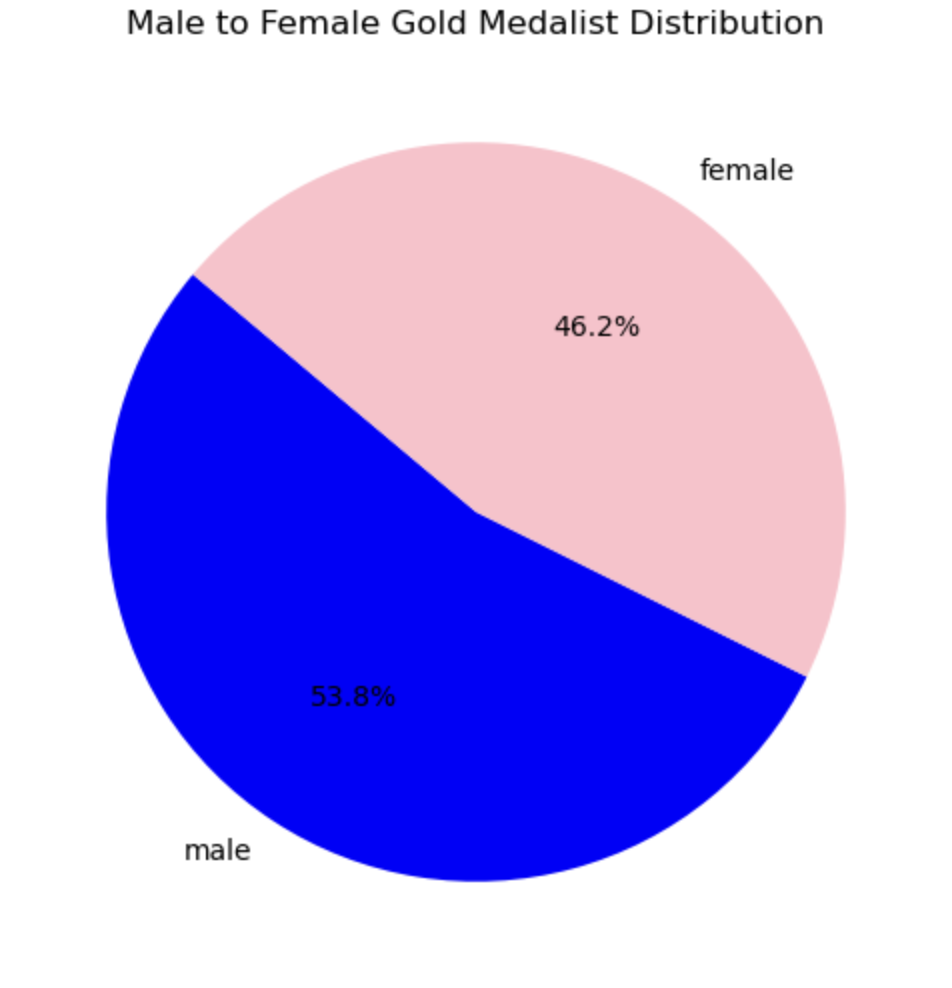
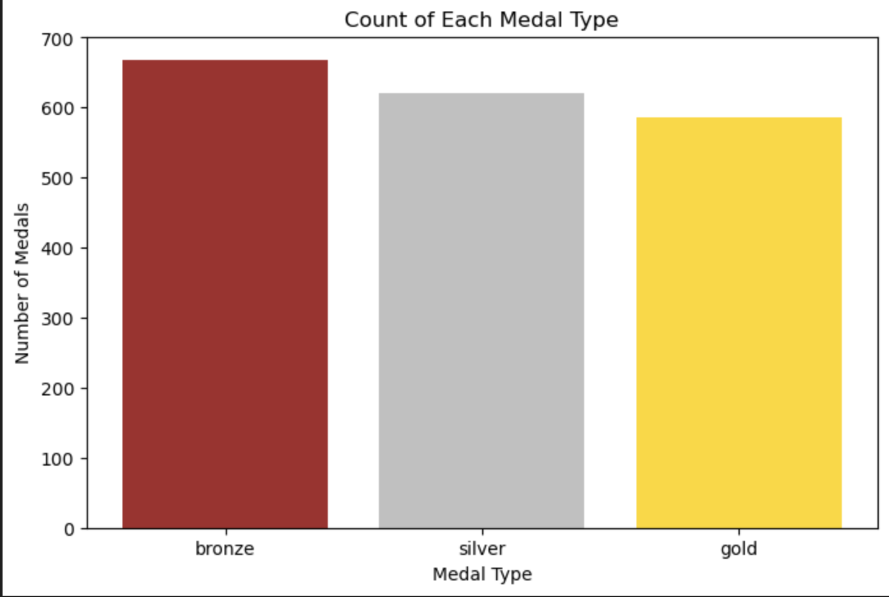
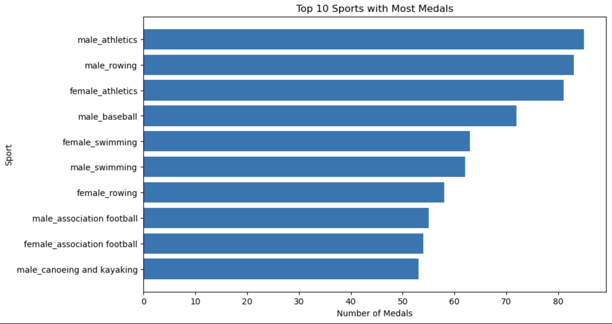

# Tidy Data Project

## Overview
The goal of this project is to clean and structure a dataset using tidy data principles to make it easier to analyze and visualize. Tidy data ensures that each variable has its own column, each observation has its own row, and each value is placed in its appropriate cell. By transforming messy data into a tidy format, we enhance the efficiency of analysis, visualization, and machine learning applications. Those who have experienced messy data know the value of a tidy data set, and this time it was my turn to use Python for the messy dataset to undergo a makeover! [Here is the link to the ipynb file](https://github.com/paulinaturner/TURNER-Python-Portfolio/blob/main/TidyData-Project/Tidy_Data_File.ipynb)

### How This Project Enhances My Portfolio
This project demonstrates my ability to clean, reshape, and prepare real-world datasets for analysis using Python. It highlights my understanding of tidy data principles, data transformation, and effective documentation using code comments and markdown.

 #### Key Skills Showcased in This Project
   - Data Cleaning with Pandas
   - Tidy Data Reshaping
   - Data Visualization with Matplotlib
   - Exploratory Data Analysis (EDA)

## About the data set 
The original data set is the 2008 Summer Olympic Medalists, not by country but by place of birth. However, for this project we were given a data set that was only **based** on this original set. Some information was pulled out, like birth place. We were left with the sports by gender, medal, and medalist name. 

[Link to CSV file I used](https://canvas.nd.edu/courses/113532/files/4771790?wrap=1)

  ### Processing steps 
   Some of the steps necessary included melting the data, filtering out the Nan variables, renaming certain column titles, splitting the 
   contents of some columns, and dropping unnecessary columns. 
   
## Instructions 
   1.Pip install pandas matplotlib jupyter. This ensures you have the right Python libraries installed. 
   
   2. Open the Notebook, launch Jupyter Notebook and open tidy_data_project.ipynb:
      
   4. Load data set
      
   5. Clean, transform data (tidy)
      
   6. Create Visualizations
      
   7. Create Pivot Tables
      
   8. Analyze data

## Visualizations 

## References
The following links helped me thoughout this process. 

[Tidy Data Principles](https://vita.had.co.nz/papers/tidy-data.pdf)

[Pandas Cheat Sheet](https://pandas.pydata.org/Pandas_Cheat_Sheet.pdf)
